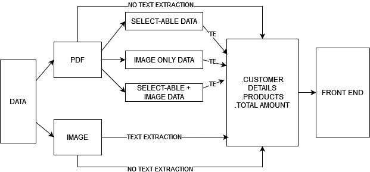
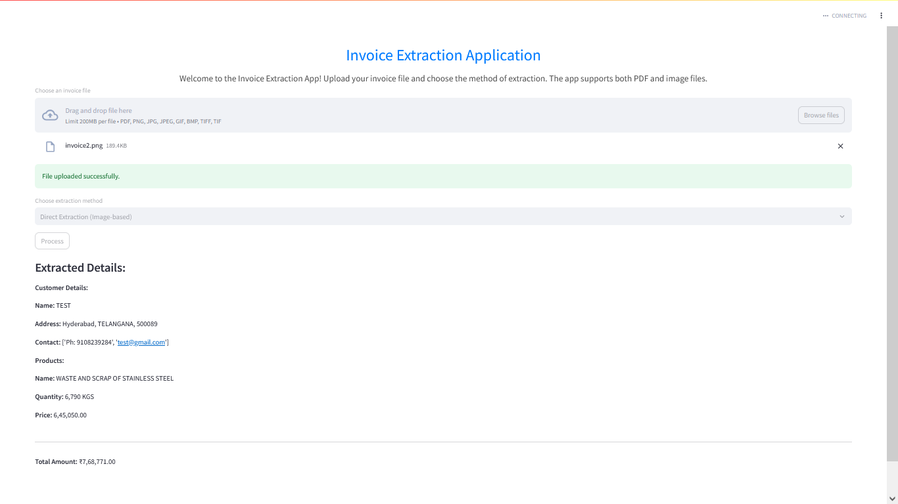

Here's a comprehensive `README.md` file for your invoice extraction Streamlit application:

```markdown
# Invoice Extraction Application

## Overview

The Invoice Extraction Application is a powerful tool built with Python and Streamlit that allows users to extract and process invoice details from various file types, including PDFs and images. This application leverages Optical Character Recognition (OCR) and Generative AI to provide structured data from invoices.

## Features

- **File Upload**: Supports uploading of PDF and image files.
- **Extraction Methods**: Offers two methods of extraction:
  - **Direct Extraction (Image-based)**: Processes images directly for extraction.
  - **Text Extraction (Text-based)**: Extracts text from PDFs and then processes the text.
- **Structured Output**: Provides extracted invoice details in a well-organized JSON format.

## Requirements

Ensure you have Python 3.7+ installed. Create a virtual environment and install the necessary packages listed in `requirements.txt`:

```bash
pip install -r requirements.txt
```

## Setup

1. **Clone the Repository**

   ```bash
   git clone https://github.com/MITTALBHAVYA/swipeinterntask
   cd invoice-extraction-app
   ```

2. **Set Up Environment Variables**

   Create a `.env` file in the project root directory with the following content:

   ```env
   GEMINI_API_KEY=your_api_key_here
   ```

   Replace `your_api_key_here` with your actual API key.

3. **Run the Application**

   Start the Streamlit app:

   ```bash
   streamlit run app.py
   ```

   This will launch the application in your default web browser.

## Usage

1. **Upload a File**

   Use the file uploader to choose an invoice file. Supported formats include PDF and common image formats (PNG, JPG, JPEG, GIF, BMP, TIFF).

2. **Select Extraction Method**

   Choose between:
   - **Direct Extraction (Image-based)**: Suitable for image files.
   - **Text Extraction (Text-based)**: Suitable for PDF files.

3. **Process the File**

   Click the "Process" button to start the extraction. The application will process the file and display the extracted details.

4. **View Results**

   The extracted details will be displayed in a structured format. You can see customer details, product information, and the total amount extracted from the invoice.

## Contributing

Contributions are welcome! Please fork the repository and submit a pull request with your changes. Ensure your code adheres to the project's coding standards and includes relevant tests.

## License

This project is licensed under the MIT License. See the [LICENSE](LICENSE) file for details.

## Contact

For any questions or issues, please reach out to:

- **Author**: Bhavya Mittal
- **Email**: bhavya12mittal@gmail.com
- **GitHub**: [yourusername](https://github.com/MITTALBHAVYA/swipeinterntask)

## Acknowledgments

- **PaddleOCR**: For Optical Character Recognition.
- **PyMuPDF**: For PDF text extraction.
- **Streamlit**: For creating the web application interface.
- **Google Generative AI**: For AI-powered text extraction.

```

### Instructions:
1. **Clone and Setup**: Instructions for cloning the repository and setting up the environment.
2. **Run the Application**: How to start the Streamlit app.
3. **Usage**: Detailed steps on how to use the application.
4. **Contributing**: Guidelines for contributing to the project.
5. **License and Contact**: Licensing information and contact details.

Feel free to adjust the contact details and any other specifics according to your project and preferences!

</br>
